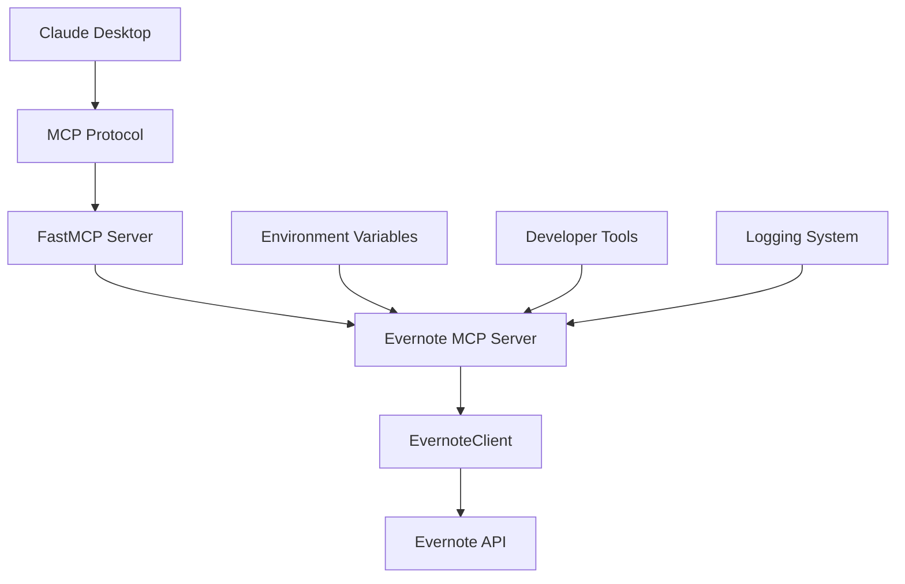

# 📚 Evernote MCP Server - Technical Study Guide

> **A Deep Dive into Model Context Protocol Integration with Evernote API**

This comprehensive guide explains how the Evernote MCP server works under the hood, covering architecture, implementation details, and the MCP protocol integration.

## 📋 Table of Contents

1. [Architecture Overview](#-architecture-overview)
2. [MCP Protocol Deep Dive](#-mcp-protocol-deep-dive)
3. [Code Structure Analysis](#-code-structure-analysis)
4. [API Integration Details](#-api-integration-details)
5. [Developer Mode Implementation](#-developer-mode-implementation)
6. [Error Handling & Logging](#-error-handling--logging)
7. [Security Considerations](#-security-considerations)
8. [Performance Optimizations](#-performance-optimizations)
9. [Troubleshooting Guide](#-troubleshooting-guide)
10. [Extension Points](#-extension-points)

---

## 🏗️ Architecture Overview

### **High-Level Architecture**



### **Component Breakdown**

| Component | Responsibility | Key Features |
|-----------|---------------|--------------|
| **Claude Desktop** | AI client that communicates via MCP | Natural language interface, tool invocation |
| **MCP Protocol** | Standard communication protocol | JSON-RPC based, tool/resource definitions |
| **FastMCP Server** | MCP framework implementation | Automatic tool registration, request routing |
| **EvernoteClient** | API wrapper for Evernote | Authentication, request handling, error management |
| **Developer Tools** | Advanced debugging features | Config inspection, dry runs, API testing |

---

## 🔌 MCP Protocol Deep Dive

### **What is MCP?**

The Model Context Protocol (MCP) is a standardized way for AI assistants to interact with external tools and data sources. It defines:

- **Tools**: Functions the AI can call (e.g., `create_note`, `search_notes`)
- **Resources**: Data the AI can access (e.g., `notebooks://list`, `tags://list`)
- **Communication**: JSON-RPC over stdio/HTTP

### **MCP Message Flow**

```
1. Claude sends tool request → 
2. MCP server validates request → 
3. Tool function executes → 
4. Evernote API called → 
5. Response processed → 
6. Result returned to Claude
```

### **Tool Definition Example**

```python
@app.tool()
async def create_note(
    title: str,
    content: str,
    notebook_name: Optional[str] = None,
    tags: Optional[List[str]] = None,
    dry_run: bool = False
) -> Dict[str, Any]:
```

**What happens here:**
1. `@app.tool()` registers this function as an MCP tool
2. FastMCP automatically generates the JSON schema
3. Claude sees this as an available action
4. Type hints ensure proper validation

### **Resource Definition Example**

```python
@app.resource("notebooks://list")
async def list_notebooks_resource() -> str:
```

**What happens here:**
1. Defines a resource with URI `notebooks://list`
2. Claude can access this data on-demand
3. Returns JSON string with notebook information
4. Updates automatically when accessed

---

## 🧩 Code Structure Analysis

### **File Organization**

```
evernote-mcp-server/
├── evernote_mcp_server.py     # Main server implementation
├── test_server.py             # Testing framework
├── setup.py                   # Installation automation
├── requirements.txt           # Dependencies
├── README.md                  # User documentation
├── TECHNICAL_STUDY_GUIDE.md   # This file
├── GITHUB_SETUP.md           # GitHub upload guide
├── claude_desktop_config.json # Configuration template
├── .gitignore                # Security exclusions
└── LICENSE                   # MIT license
```

### **Core Classes Deep Dive**

#### **EvernoteClient Class**

```python
class EvernoteClient:
    def __init__(self, developer_token: str, is_sandbox: bool = True):
        self.developer_token = developer_token
        self.host = EVERNOTE_SANDBOX_HOST if is_sandbox else EVERNOTE_PRODUCTION_HOST
        self.base_url = f"https://{self.host}/edam"
```

**Key Methods:**

1. **`_make_request()`** - Core HTTP communication
   - Handles authentication headers
   - Implements retry logic
   - Logs requests/responses in dev mode
   - Converts HTTP errors to meaningful messages

2. **`search_notes()`** - Note search functionality
   - Constructs Evernote search filters
   - Supports notebook filtering
   - Handles pagination limits
   - Returns structured note metadata

3. **`create_note()`** - Note creation
   - Converts plain text to ENML format
   - Handles notebook GUID resolution
   - Manages tag assignment
   - Returns created note details

### **MCP Tool Implementation Pattern**

Every MCP tool follows this pattern:

```python
@app.tool()
async def tool_name(parameters) -> Dict[str, Any]:
    # 1. Validate client initialization
    if not evernote_client:
        return {"error": "Client not initialized"}
    
    # 2. Developer mode checks (dry run, logging)
    if DEV_MODE and dry_run:
        logger.info("DRY RUN: ...")
        return {"status": "success (dry run)"}
    
    # 3. Execute core logic
    try:
        result = await evernote_client.some_operation()
        return {"success": True, "data": result}
    except Exception as e:
        logger.error(f"Error: {e}")
        return {"error": str(e)}
```

---

## 🌐 API Integration Details

### **Evernote API Specifics**

#### **Authentication Flow**

```python
headers = {
    "Authorization": f"Bearer {self.developer_token}",
    "Content-Type": "application/json"
}
```

**How it works:**
1. Developer token acts as permanent authentication
2. No OAuth flow needed for personal use
3. Token includes permissions (Basic vs Full access)
4. Sandbox vs Production environments use different hosts

#### **ENML Format Handling**

Evernote uses ENML (Evernote Markup Language) for note content:

```python
enml_content = f"""<?xml version="1.0" encoding="UTF-8"?>
<!DOCTYPE en-note SYSTEM "http://xml.evernote.com/pub/enml2.dtd">
<en-note>{content}</en-note>"""
```

**Why this matters:**
- Plain text needs XML wrapping
- HTML content needs ENML conversion
- Proper DOCTYPE ensures compatibility
- Invalid ENML causes API errors

#### **Error Code Mapping**

| HTTP Code | Meaning | Action |
|-----------|---------|---------|
| 401 | Invalid token | Re-authenticate |
| 403 | Insufficient permissions | Upgrade API access |
| 404 | Resource not found | Check GUIDs |
| 429 | Rate limit exceeded | Implement backoff |
| 500 | Server error | Retry later |

---

## 🛠️ Developer Mode Implementation

### **Environment Variable System**

```python
DEV_MODE = os.getenv("DEV_MODE", "false").lower() == "true"
```

**How it works:**
1. Reads `DEV_MODE` environment variable
2. Defaults to `false` for production safety
3. Enables advanced features when `true`
4. Can be set in Claude Desktop config

### **Advanced Logging**

```python
if DEV_MODE:
    logger.debug(f"Making {method} request to {self.base_url}{endpoint}")
    if data:
        logger.debug(f"Request data: {json.dumps(data, indent=2)}")
    
    logger.debug(f"Response Status: {response.status_code}")
    logger.debug(f"Response Body: {response.text}")
```

**Logging Levels:**
- **INFO**: Basic operation status
- **DEBUG**: Detailed request/response data (dev mode only)
- **ERROR**: Failures and exceptions
- **WARNING**: Configuration alerts

### **Dry Run Implementation**

```python
if DEV_MODE and dry_run:
    logger.info(f"DRY RUN: Would create note titled '{title}'")
    return {"status": "success (dry run)", "action": "create_note"}
```

**Benefits:**
- Test prompts without modifying data
- Debug tool parameters
- Validate logic flow
- Safe experimentation

### **Developer Tools**

#### **`dev_get_config`**
```python
@app.tool()
async def dev_get_config() -> Dict[str, Any]:
    return {
        "host": evernote_client.host,
        "is_sandbox": evernote_client.host == EVERNOTE_SANDBOX_HOST,
        "token_preview": f"{token[:4]}...{token[-4:]}"
    }
```

#### **`dev_clear_config`**
```python
@app.tool()
async def dev_clear_config() -> Dict[str, Any]:
    global evernote_client
    evernote_client = None
    return {"status": "success", "message": "Configuration cleared."}
```

#### **`dev_api_test`**
```python
@app.tool()
async def dev_api_test() -> Dict[str, Any]:
    user_info = await evernote_client._make_request("GET", "/user")
    return {"status": "success", "user": user_info}
```

---

## ⚠️ Error Handling & Logging

### **Exception Hierarchy**

```python
try:
    result = await evernote_client.operation()
    return {"success": True, "data": result}
except httpx.HTTPStatusError as e:
    # HTTP-specific errors
    logger.error(f"HTTP error: {e.response.status_code}")
    return {"error": f"API error: {e.response.status_code}"}
except Exception as e:
    # Generic errors
    logger.error(f"Unexpected error: {e}")
    return {"error": f"Operation failed: {str(e)}"}
```

### **Logging Strategy**

```python
# Configure logging with timestamp and level
logging.basicConfig(
    level=log_level, 
    format='%(asctime)s - %(name)s - %(levelname)s - %(message)s'
)
```

**Log Levels by Mode:**
- **Production**: INFO and above
- **Development**: DEBUG and above
- **Error Tracking**: All ERROR/WARNING messages

---

## 🔒 Security Considerations

### **Token Management**

```python
# .gitignore includes:
*.env
**/*token*
**/*secret*
**/*key*
```

**Security measures:**
1. Environment variables for sensitive data
2. `.gitignore` prevents token commits
3. Token preview masking in dev tools
4. No token storage in code

### **Input Validation**

```python
# Type hints provide automatic validation
async def create_note(
    title: str,  # Must be string
    content: str,  # Must be string
    tags: Optional[List[str]] = None  # Must be list of strings or None
) -> Dict[str, Any]:  # Return type enforced
```

### **Sandbox Mode**

```python
EVERNOTE_SANDBOX_HOST = "sandbox.evernote.com"
EVERNOTE_PRODUCTION_HOST = "www.evernote.com"
```

**Benefits:**
- Safe testing environment
- No risk to production data
- Separate API quotas
- Development experimentation

---

## ⚡ Performance Optimizations

### **Async/Await Pattern**

```python
async with httpx.AsyncClient() as client:
    response = await client.get(url, headers=headers)
```

**Why async:**
- Non-blocking I/O operations
- Better resource utilization
- Concurrent request handling
- Responsive user experience

### **Connection Pooling**

```python
async with httpx.AsyncClient() as client:
    # Automatic connection reuse
    # TCP connection pooling
    # SSL session reuse
```

### **Response Caching Strategy**

```python
# Resources cache automatically
@app.resource("notebooks://list")
async def list_notebooks_resource() -> str:
    # Called only when Claude requests it
    # Results can be cached by MCP client
```

---

## 🔍 Troubleshooting Guide

### **Common Issues & Solutions**

#### **"Evernote client not initialized"**
```python
# Check this in tools:
if not evernote_client:
    return {"error": "Evernote client not initialized"}
```
**Solution:** Run `configure_evernote` tool first

#### **Import Errors**
```bash
# Test each dependency:
python -c "import httpx; print('✅ httpx OK')"
python -c "from mcp.server.fastmcp import FastMCP; print('✅ MCP OK')"
```

#### **API Authentication Failures**
```python
# Check token in dev mode:
config = await dev_get_config()
print(config["token_preview"])
```

### **Debugging Workflow**

1. **Enable Developer Mode**
   ```json
   "env": {"DEV_MODE": "true"}
   ```

2. **Check Configuration**
   ```
   dev_get_config
   ```

3. **Test API Connection**
   ```
   dev_api_test
   ```

4. **Use Dry Run Mode**
   ```
   create_note(title="Test", content="Test", dry_run=True)
   ```

---

## 🔧 Extension Points

### **Adding New Tools**

```python
@app.tool()
async def new_tool(param: str) -> Dict[str, Any]:
    """
    New tool description for Claude
    
    Args:
        param: Parameter description
    
    Returns:
        Tool result
    """
    if not evernote_client:
        return {"error": "Client not initialized"}
    
    try:
        # Implementation here
        result = await evernote_client.new_operation(param)
        return {"success": True, "data": result}
    except Exception as e:
        logger.error(f"Error in new_tool: {e}")
        return {"error": str(e)}
```

### **Adding New Resources**

```python
@app.resource("new://resource")
async def new_resource() -> str:
    """Resource that provides new data"""
    if not evernote_client:
        return "Error: Client not initialized"
    
    try:
        data = await evernote_client.get_new_data()
        return json.dumps(data, indent=2)
    except Exception as e:
        return f"Error: {str(e)}"
```

### **Custom API Endpoints**

```python
async def custom_evernote_operation(self, params):
    """Add new Evernote API operations"""
    endpoint = f"/custom/{params['id']}"
    return await self._make_request("GET", endpoint)
```

---

## 📊 Testing Framework

### **Automated Testing**

```bash
# Non-interactive mode for CI/CD
python test_server.py --non-interactive --token "TOKEN"

# Exit codes:
# 0 = All tests passed
# 1 = Some tests failed
```

### **Test Categories**

1. **Dependency Tests**: Verify all imports work
2. **MCP Server Tests**: Check server loads correctly
3. **Configuration Tests**: Validate Claude Desktop setup
4. **API Tests**: Test Evernote connectivity (optional)

### **Manual Testing Checklist**

- [ ] Server starts without errors
- [ ] Claude Desktop sees MCP tools
- [ ] Configuration tool works
- [ ] Search functionality works
- [ ] Note creation works
- [ ] Developer tools work (if enabled)

---

## 🎯 Key Takeaways

### **What Makes This Implementation Special**

1. **Developer-Friendly**: Comprehensive debugging tools and verbose logging
2. **Production-Ready**: Proper error handling and security measures
3. **Extensible**: Clear patterns for adding new functionality
4. **Well-Documented**: Extensive inline and external documentation
5. **Testable**: Automated test suite with CI/CD support

### **MCP Best Practices Demonstrated**

1. **Clear Tool Definitions**: Descriptive docstrings and type hints
2. **Resource Management**: Efficient data access patterns
3. **Error Handling**: Graceful failure modes
4. **Security**: Safe credential handling
5. **Performance**: Async operations and connection pooling

---

## 📚 Further Learning

### **Related Technologies**
- **MCP Protocol**: [Official Documentation](https://modelcontextprotocol.io/)
- **FastMCP Framework**: Python MCP server framework
- **Evernote API**: [Developer Documentation](https://dev.evernote.com/doc/)
- **asyncio**: Python asynchronous programming
- **httpx**: Modern HTTP client for Python

### **Advanced Topics**
- OAuth implementation for multi-user support
- WebSocket transport for real-time updates
- Custom MCP protocol extensions
- Performance monitoring and metrics
- Advanced error recovery strategies

---

*This guide provides a comprehensive understanding of how the Evernote MCP server works. Use it to understand the implementation, debug issues, or extend functionality.*

**Happy coding! 🚀** 